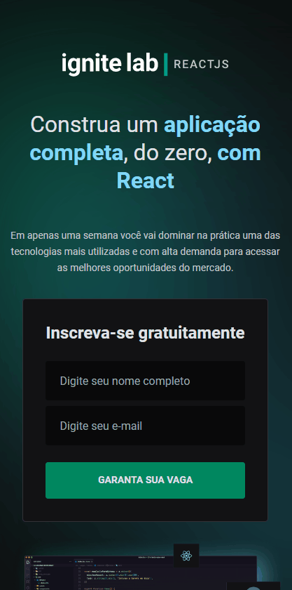
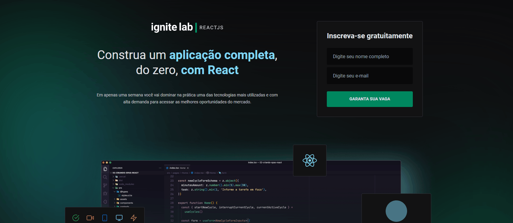

<h1 align="center" > Lesson Platform </h1>

O Projeto é uma plataforma que possibilita a visualização de aulas, palestras e etc.

Neste projeto, o usuário escolhe a aula que quer assistir quando e onde estiver, pois o plataforma é responsiva.

Acesse a aplicação em funcionamento!
Link: [https://lesson-platform.vercel.app/](https://lesson-platform.vercel.app/)

## Fotos da aplicação:

    <h3>Mobile App:</h3>
    
    <h3>Web APP:</h3>
    
 

## Tecnologias Utilizadas:

✔️ ReactJS
✔️ Typescript
✔️ Vite
✔️ TailwindCSS
✔️ phosphor-react
✔️ GraphQL

## Como Inicializar:

<h1 align="center">O que aprendi 👨‍💻</h1>
<ul>
    <li>Como o GraphQL pode ajudar na produtividade de aplicações</li>
    <li>Uso do Tailwind como ferramenta de produtividade, pois ela pode reduzir bastante o tempo necessário para a estilização</li>
    <li>Uso do TypeScript como ferramenta de desenvolvimento</li>
  
   
</ul>  

Made with 💜 by João Artur 👋 See my <a href="https://www.linkedin.com/in/magalhesartur/">Linkedin</a>

